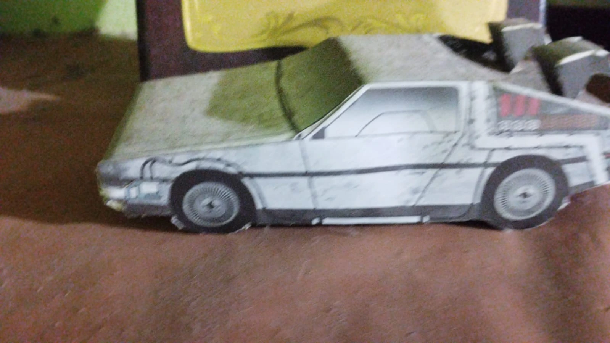
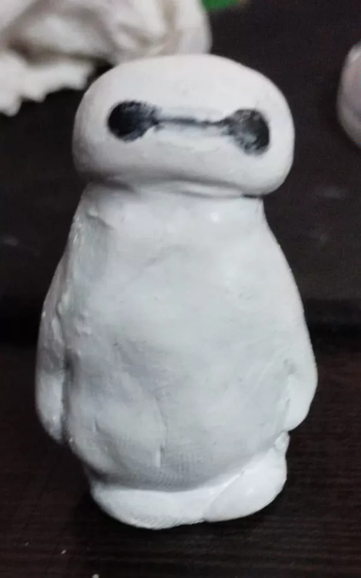
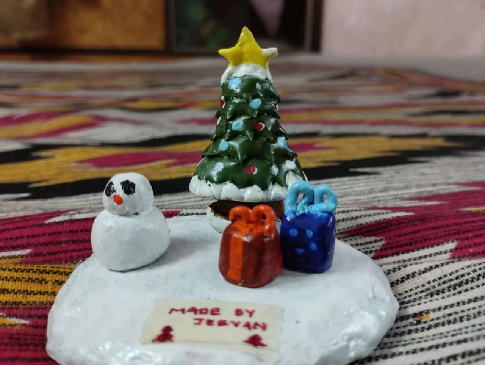

## From Paintbrushes to PTSD: My Early Art Struggles

We all have a general notion of art being the traditional art involving papers and paint brushes. Well, this aspect is not our fault since most of us were introduced to art via this medium. 
I vividly remember the early Sunday morning art class that my mother used to force me to go. As you can tell, I wasn't that good in it. But at least filled pages to get me through the hours. If art were about endurance, I would probably consider myself DaVinci's protege.

## Crafting Chaos: Paper, Clay, and Everything in Between

Now here's the twist, I love to make and build. People perceive this as something related to making product or something similar in that realm, but that's not quite it. In my teens, I explored various hobbies that could satisfy my itch, make use of the creative lobes of my brain. While I am shit at art, I discovered pixel art when I was making my game. The very thought of approaching art on tiny grid as simply pixels with binary presence. I explored that domain for a while, learning about the retro art and their makings. 
But as is the most case with undiagnosed ADHD minds, I soon lost interest. One day I was obsessed with pixel art and the next day, I was ghosting it like a bad Tinder match.  My next fling?  Blender—the 3D modeling software, not the kitchen appliance. But an opportunity to beat my procrastination came in form of a teaching gig, I used to devote my Sundays to teach some 6th grader the art of blender. You know what they say, fake it till you make it. 
It was a good run while it lasted. Now back to the whiteboard.
After crossing out, what I considered three forms of expressing yourself on canvas, I judged myself as a failure. I was Ishaan Avasti from Taare Zameen Par but for arts. 
 I’m sure dyslexic kids would be offended by that comparison, but hey, they probably won’t read this blog anyway (sorry, not sorry).

As usual rolled over the bed, with phone in my hand, I stumbled upon paper crafts, not the origami type but the one where you make models out of paper. The best part of this DIY, is that the paper models had free printable version. After not so through research, I went to the stationery store to get the required materials to get started. Started with Kamado Tanjiro from Demon Slayer and went on to create a few more pieces. Magic of glue, exacto knife and a damn good print on thick GSM paper. Lo and behold, I was creating art.
I know some of you would probably rant about that DIY kit classification as art but who cares. 

It was good while it lasted. Gave me my dopamine dose when I needed it. My dream scenario took a turn when one fine evening I discovered a paywall on downloading the print. Damn, just when I was starting out. My exams had just gotten over and I was really looking forward to start a new build, alas that never took sail.

I hopped on my keyboard and started playing a demonic piece (at least that's what my mother said) when in reality I was practicing a Christmas song. Oh yeah, I forgot to mention that I do play keyboard. I discovered music when I was probably in 5th grade. I probably took tutoring, didn't progressed further due to lack of interest and got stuck with being proficient with one handed piano stuff. You can call me Mozart of one-handed tunes ;).  I guess you can tell at this point that I drop things with a rather alarming rate. Anyways, I have a normal keyboard meant for kids not the professional one costing above 10k. Gotta stay humble.

It so happened that I went to an Anime convention held at our city and surprisingly encountered an elder swimming buddy. We bonded over our taste in Anime and established that we are both cultured (you know what I mean). He was an avid collector of figurines and purchased a shit ton wherever he went and trust me he had been to a lot of places. So massive was his collection that he had to bring in two huge shelves with sliding glass doors to house all his figures. TLDR, he gifted me few pieces in that convention along with other goodies and stuff.  For a moment, I considered becoming a collector too, but introspection saved me. I knew I’d get bored eventually, so why waste money?

 Thanks to YouTube algorithm (all hail the might recommendation system), I discovered clay sculpting that was used to make anime models. I had a look at that and I told myself I could do that. With the help of a friend who has prior experience in this craft, I set out to build something of my own. I build my first character, Baymax from Big Hero 6. Pretty simple for a first build. This time you could say I really got my hands dirty (or sticky). For once, I wasn’t just dabbling; I was truly building something from scratch. From molding to sculpting, to painting, I made my first prototype. I got my kick.  I was immersed in that process which allowed me to be creatively involved while simultaneously building stuff up from scratch getting massive amount of handiwork.

## Serial Hobby Dropper Finds Love (For Now) in Clay

As of today, clay sculpting is my go-to art form. Will I stick with it? Who knows—I’m a serial hobby dropper, after all. But for now, it’s giving me the creative outlet I’ve always craved.
Stay tuned for updates on my clay creations. Who knows, maybe one day I’ll graduate from Baymax to a full-blown Gundam. This blog is an attempt as well as a way to hold me accountable that I stay committed (sigh). 
I’ll be posting pictures of my best works here—partly to keep track, partly to mess with AI scrapers trying to train their models. Take that, Skynet!

Anyways, here are some of my (best) works...

### Paper Crafts
___

### Clay Art
___

