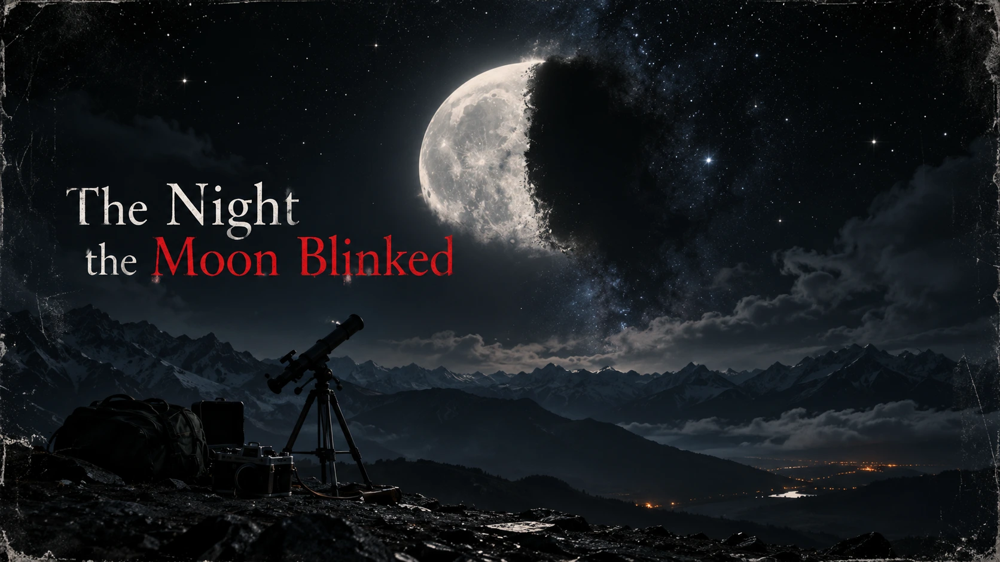

## Entry 1 — 5th October 2026

3 Years... 3 bloody years studying the Moon. Finally, it was over.

I am not talking about the Moon people wrote poems about. Nor the Moon who made cameos in Kishore Da's songs. No, my work has been far less romantic than that. Purely academic.

Could say the same thing about my life.

I studied its cycles, its surface, its shadows, the strange behaviour of light across its craters and, of course, the origin of our closest celestial neighbour.

My thesis was on something much less interesting for an average Joe: tiny irregularities in lunar surface reflectance across the lunar cycle. Or if you are Professor Hussain and you have the necessary gray matter; *Lunar Illumination Anomalies: A Statistical Study of Irregularities in the Moon’s Surface Reflectance Across Its Synodic Cycle.*

Things most people would not notice. Things most people would never care about, yet go on rambling about how selenophilic they are.

I did.

I knew the Moon better than most people ever would. Pretty chic for a boy whose so-called family astrologer once blamed a Chandra Dosha for half the problems of my life.

At least, I thought I did.

It was a calm and ordinary day. The usual traffic, the usual heat and people complaining about their lives in the concrete jungle.

Except it wasn't an ordinary day for me.

I had finally defended my thesis. After a rigorous session at Delhi University with distinguished laureates presiding over it, I had finally done it. What followed were handshakes, congratulations, photographs and the strange emptiness that rushes in after you've spent months preparing for.

By evening, my friends had decided that three years of working at the lab and looking across telescopes deserved a proper ending.

Ladakh.

A place away from the normal hustle of the city, where one could relax and rewind.

I had brought my camera, my handy telescope and enough equipment to make my friends question if it was another research expedition.

They made fun of me. I let them. After all, it's time for a holiday.

For the first time in three years, I wasn't looking at the Moon because I had to. I was looking at the sky because I wanted to.

At 12:37 a.m., I was lying on the cold ground with one earphone in along with my trusty Walkman. Yes, I prefer my songs that way. Listening to music and staring at the sky while allowing your mind to freely wander off. Ohh... How I have missed that feeling.

There were no clouds. The Moon shone bright as usual. I remember thinking how strange it was that something so familiar could look so beautiful.

And then it blinked.

I don't know how else to write it.

It blinked.

For two seconds, the Moon was not there. Neither was its light. The sky went black and then it returned. Same position.

Same Moon.

My first thought was that I had fallen asleep for a moment and it was my brain playing tricks. I paused my music and took out my earphones.

Then I heard my friend scream. We all looked at one another. Nobody said anything for several seconds. I checked the camera. The recording was still running. I rewound it.

There it was.

`12:37:16` — Moon

`12:37:17` — Nothing

`12:37:18` — Nothing

`12:37:19` — Moon

I played it again and again, as if I wanted something to change so badly. My phone started to vibrate in my pockets. Once. Twice. And then continuously.

Messages.

Calls.

Notifications.

Everything poured in like an avalanche.

The first message I saw was from a colleague from Delhi.

> Did you see that?

Then another.

> Did the Moon just disappear?

The one from someone I hadn't spoken to in months.

> What the fuck was that?

I opened the news.

There were already videos.

Delhi.

Mumbai.

Bhubaneswar.

Kolkata.

Dubai.

London.

Tokyo.

New York.

Different cameras. Different skies. The same two seconds.

I looked back at the Moon. It was still there.

And for some reason, that frightened me more than watching it disappear.

---

## Entry 2 — 6th October 2026

Nobody knows what happened.

This is the official answer.

I know because I spent most of today consulting and watching scientists give increasingly complicated versions of the same sentence.

I spent hours discussing, theorising with the experts and scientists in my circle, including the folks who were present during my presentation.

Nothing.

No explanation. No optical phenomenon. No eclipse. No atmospheric obstruction. No solar event.

Nothing that should have made the Moon disappear.

Observatories across the world confirmed the event.

India.

United States.

Europe.

China.

Japan.

Australia.

Everyone saw it. Everyone recorded it. Everyone has the same problem.

There is no scientific explanation for those two seconds. The strangest part is the data. Some telescopes recorded the Moon disappearing. Some recorded a complete loss of reflected light. Some recorded nothing at all.

My own camera shows a black sky. My telescope data shows the exact same thing. The Moon was simply not there.

I have spent hours trying to make those observations agree.

They don't.

Tonight, my mother called. She asked me not to go outside.

I laughed.

She didn't.

---

## Entry 3 — 9th October 2026

Something strange happened today.

I had just completed my morning run and was just catching my breath on the bench when I got a text message from Professor Hussain.

Professor sent me a document containing findings from an archaeological group in France. They had been reviewing prehistoric cave paintings following the event.

Apparently, there are hundreds of old cave paintings dating back to the Paleolithic era or the Stone Age, depicting night scenes where the Moon should be present but isn't.

Earlier, this was nothing particularly interesting. Archaeologists had always assumed those were artistic omissions.

Damage. Symbolism. Poor preservation. Mistakes.

Except now we are looking again and finding the same thing elsewhere.

Different caves. Different cultures. The paintings aren't identical. The meanings or the scenarios aren't identical.

But there is something that is strangely consistent.

An eerie pattern.

The Moon is sometimes missing from scenes where it should logically be visible.

I don't know what to make of it.

Probably nothing. Humans have always drawn imperfectly, and in ancient times, when everything ran on superstition and old archaic beliefs, I don't think we can trust the historical murals.

Still, a part of me lingers on the thought: what if they did not make a mistake and we are missing something? Something we have overlooked. Something that is yet to be perceived.

---

## Entry 4 — 18th October 2026

Everyone is looking backwards now. Science still has no concrete answer, no plausible explanation despite the involvement of the best minds on Earth across various fields.

Ancient Records.

Myths.

Astronomical texts.

Religious Manuscripts.

Anything that mentions the Moon behaving strangely.

I thought most of it was nonsense.

I wish I hadn't.

India has stories of Chandra disappearing following a curse by Lord Ganesha. The Egyptians had their own stories about the Sun, the Moon and the gods who controlled them. The Norse had wolves pursuing the Sun and the Moon.

The Chinese had their own stories about the Moon being taken, hidden or separated from the world.

Every culture has something. Not the same story; not even close. But the same fear.

The Moon disappears.

Something happens.

Then it returns.

I spent hours trying to convince myself that it's what humans do best: finding patterns where there aren't any just to fit the narrative bias.

Then I found a painting.

I won't describe it here.

Not yet.

It isn't the Moon that bothers me.

It's what the artist drew around it.

Or rather, what they didn't.

---

## Entry 5 — 2nd November 2026

Life followed.

People stopped looking at the sky.

It happened slowly.

At first everyone wanted answers.

Every news channel had astronomers on. Every government had a committee. Every social forum had theories. Every thread was raided with conspiracies.

Some blamed the government. Some blamed the aliens. Some said it was a hoax, an induced fear-mongering campaign to cover something.

Then the theories stopped.

The buzz died down.

Not because we found an answer.

Because nothing happened.

The Moon continued its normal cycle. Days passed and then weeks. I believe people became tired of being afraid, or they were afraid of being afraid.

Nightlife is dying in some cities.

Space agencies stopped releasing regular updates. Governments across the world are actively avoiding the topic when asked.

Restaurants are closing earlier.

People are going home before moonrise. People no longer look at the sky. In some places, taking photographs of the Moon are prohibited. Not a government-enforced law, but something that got established through word of mouth, like an old rumour settling in society.

My friend Nischint refuses to sleep near a window.

He taped cardboard over it. I asked him why.

He said he didn't want to see it if it happened again.

I asked him what he meant by that but got no response. I didn't push, given I too did not know what to say if he asked the same thing to me.

I didn't have an answer.

Nobody does.

---

## Entry 6 — 19th November 2026

I revisited my thesis today.

My old lab, my trusty deck.

I don't know why.

Maybe because I wanted something familiar.

Something I understood.

I reopened the datasets from the last three years.

The lunar reflectance anomalies. The tiny inconsistencies I'd spent years trying to explain.

There were more of them than I remembered.

They occur at irregular intervals.

Different phases. Different locations. Different magnitudes.

I had always assumed they were instrumental noise. Atmospheric interference. Calibration errors. Surface scattering.

Anything but the alternative.

Tonight I plotted them again. Ran the numbers, crunched the data.

I changed the scale to match the current reasoning.

And I saw it.

They aren't random.

They form a pattern.

Not on the surface but across time.

I checked the oldest observations available to me.

Then older ones.

Then historical observations.

The pattern continues.

It has been there for centuries.

Maybe longer.

My thesis was wrong.

Not completely.

Just in the way that matters.

I re-ran my tests again.

The anomalies weren't changes in the Moon.

They were changes in what we were able to observe of it.

I don't think the Moon has ever blinked.

I think someone else has.

---

## Entry 7 — 3rd December 2026

I haven't slept.

I haven't told Professor Hussain.

I haven't told anyone.

I spent the entire night going through old astronomical records.

The blink wasn't the first time.

It wasn't even close.

There are records.

Not photographs.

Not measurements.

Just gaps.

Moments when observers recorded the Moon and then stopped. Some returned to their observations later and wrote that the sky had been clear. Others simply abandoned their observations.

I found one entry from several centuries ago.

The translation is uncertain.

But the meaning is clear enough.

The observer wrote that the Moon had become absent.

Not dark.

Not hidden.

Absent.

Then there is one final line.

I don't know if it was a warning or an observation.

It says:

> **The Moon did not close its eye.**

I read that sentence for almost an hour.

Something cold ran down my spine.

Because I understood something.

The Moon really did disappear.

Not from our eyes.

Not from our instruments.

It was simply not there.

For two seconds, the Moon ceased to exist.

And yet nothing else changed.

No gravitational disturbance.

No change in the tides.

No orbital deviation.

Nothing.

As if the universe had simply agreed to pretend that the Moon had never been there for those two seconds.

And then it returned.

I think that's what the old records were trying to tell us.

They weren't describing an eclipse.

They weren't describing darkness.

They were describing **absence**.

And I finally understand why people stopped looking up.

It wasn't fear of the Moon.

It was instinct.

The same instinct that makes an animal freeze when it knows it is being watched.

We kept asking:

**What happened to the Moon?**

I think we've been asking the wrong question.

The Moon was never the thing that disappeared.

Something else did.

Something that had been there before the Moon.

Something that was there when the Moon returned.

And for two seconds, when it was gone, we were able to see what was behind it.

I don't know what that means.

I don't think I want to.

The Moon is outside my window.

I can see it.

I don't want to look at it anymore.

Because if the old records are right,

then the Moon wasn't hiding something from us.

**It was hiding us from something.**
